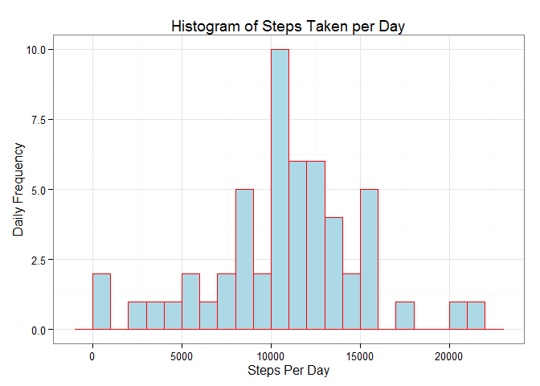
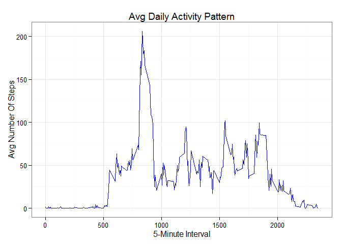
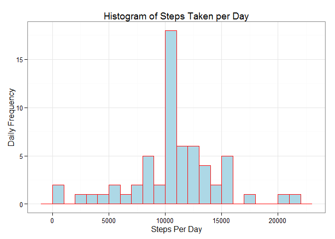

# Reproducible Research: Peer Assessment 1

## Loading and preprocessing the data

0. Setup


```r
library(ggplot2)
library(lattice)
```

1. Load the data


```r
unzip("activity.zip")
activity <- read.csv("activity.csv", header = TRUE)
```

2. Process/transform the data


```r
activity$date <- as.Date(activity$date, format = "%Y-%m-%d")
activity$interval <- as.factor(activity$interval)
```

## What is mean total number of steps taken per day?

1. Calculate the total number of steps taken per day


```r
stepsPerDay <- aggregate(steps ~ date, activity, sum)
colnames(stepsPerDay) <- c("date","steps")
```

2. Make a histogram of the total number of steps taken each day


```r
ggplot(stepsPerDay, aes(x = steps)) + 
       geom_histogram(aes(fill = cut ), col = "red", fill = "lightblue", binwidth = 1000) + 
       labs(title = "Histogram of Steps Taken per Day", x = "Steps Per Day", y = "Daily Frequency") +
       theme_bw() 
```

 

3. Calculate and report the mean and median total number of steps taken per day


```r
meanStepsPerDay <- mean(stepsPerDay$steps, na.rm=TRUE)
medianStepsPerDay <- median(stepsPerDay$steps, na.rm=TRUE)
```

The mean is **10766.19**.
The median is **10765**.

## What is the average daily activity pattern?

1. Make a time series plot (i.e. type = "l") of the 5-minute interval (x-axis) and the average number of steps taken, averaged across all days (y-axis)


```r
stepsPerInterval <- aggregate(steps ~ interval, data=activity, FUN=mean, na.rm = TRUE)
stepsPerInterval$interval <- as.integer(levels(stepsPerInterval$interval)[stepsPerInterval$interval])
colnames(stepsPerInterval) <- c("interval", "steps")

ggplot(stepsPerInterval, aes(x=interval, y=steps)) +   
       geom_line(color="blue", size=.5) +  
       labs(title="Avg Daily Activity Pattern", x="5-Minute Interval", y="Avg Number Of Steps") +  
       theme_bw()
```

 

2. Which 5-minute interval, on average across all the days in the dataset, contains the maximum number of steps?


```r
maxStepsPerInverval <- stepsPerInterval[which.max(stepsPerInterval$steps),]
```

The **835<sup>th</sup>** Interval Contains The Maximum Of **206** Steps.

## Imputing missing values

1.Calculate and report the total number of missing values in the dataset (i.e. the total number of rows with NAs)


```r
totalNAs <- sum(is.na(activity$steps))
```

The Total Number Of Missing Values Is **2304**.

2.Devise a strategy for filling in all of the missing values in the dataset. The strategy does not need to be sophisticated. For example, you could use the mean/median for that day, or the mean for that 5-minute interval, etc.

Replace each missing value with the mean value of its 5-minute interval

3.Create a new dataset that is equal to the original dataset but with the missing data filled in.


```r
newActivity <- activity 
for (i in 1:nrow(newActivity)) {
    if (is.na(newActivity$steps[i])) {
        newActivity$steps[i] <- stepsPerInterval[which(newActivity$interval[i] == stepsPerInterval$interval), ]$steps
    }
}
```


```r
totalNAs <- sum(is.na(newActivity$steps))
```

The Total Number Of Missing Values Is **0**.

4.Make a histogram of the total number of steps taken each day and Calculate and report the mean and median total number of steps taken per day. Do these values differ from the estimates from the first part of the assignment? What is the impact of imputing missing data on the estimates of the total daily number of steps?


```r
newStepsPerDay <- aggregate(steps ~ date, newActivity, sum)
colnames(newStepsPerDay) <- c("date","steps")

ggplot(newStepsPerDay, aes(x = steps)) + 
       geom_histogram(col = "red", fill = "lightblue", binwidth = 1000) + 
       labs(title = "Histogram of Steps Taken per Day", x = "Steps Per Day", y = "Daily Frequency") +
       theme_bw() 
```

 


```r
meanNewStepsPerDay   <- mean(newStepsPerDay$steps, na.rm=TRUE)
medianNewStepsPerDay <- median(newStepsPerDay$steps, na.rm=TRUE)
```

The mean is **10766.19**.
The median is **10766.19**.

The mean is unaffected, but the median of the new data increased a bit and now equals its mean.  
Finally, the value of the histogram's peak bin increased from 10 to 18.


## Are there differences in activity patterns between weekdays and weekends?

1. Create a new factor variable in the dataset with two levels - "weekday" and "weekend" indicating whether a given date is a weekday or weekend day.


```r
newActivity$dayType <- factor(format(newActivity$date, "%A"))
levels(newActivity$dayType) <- list(weekday = c("Monday", "Tuesday", "Wednesday", "Thursday", "Friday"),
                                     weekend = c("Saturday", "Sunday"))
```

2. Make a panel plot containing a time series plot (i.e. type = "l") of the 5-minute interval (x-axis) and the average number of steps taken, averaged across all weekday days or weekend days (y-axis). See the README file in the GitHub repository to see an example of what this plot should look like using simulated data.


```r
avgSteps <- aggregate(newActivity$steps, 
                      list(interval = as.numeric(as.character(newActivity$interval)), 
                      dayType = newActivity$dayType),
                      FUN = "mean")
names(avgSteps)[3] <- "meanOfSteps"

xyplot(avgSteps$meanOfSteps ~ avgSteps$interval | avgSteps$dayType, 
       layout = c(1, 2), type = "l", 
       xlab = "Interval", ylab = "Number of steps")
```

 

The weekend activity is more evenly distributed and the weekday has the highest peak.
